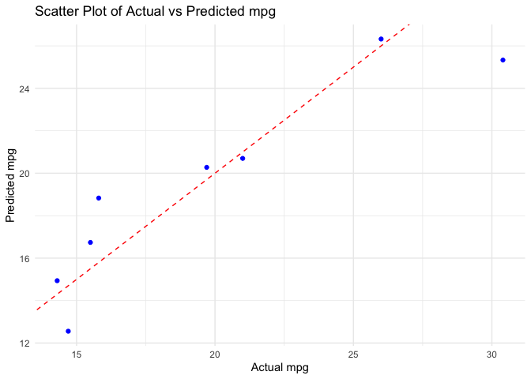

``` r
library(caret)
```

    ## Loading required package: ggplot2

    ## Loading required package: lattice

``` r
library(randomForest)
```

    ## randomForest 4.7-1.1

    ## Type rfNews() to see new features/changes/bug fixes.

    ## 
    ## Attaching package: 'randomForest'

    ## The following object is masked from 'package:ggplot2':
    ## 
    ##     margin

``` r
library(ggplot2)
```

``` r
# Load mtcars dataset
data(mtcars)

# Explore the dataset
str(mtcars)
```

    ## 'data.frame':    32 obs. of  11 variables:
    ##  $ mpg : num  21 21 22.8 21.4 18.7 18.1 14.3 24.4 22.8 19.2 ...
    ##  $ cyl : num  6 6 4 6 8 6 8 4 4 6 ...
    ##  $ disp: num  160 160 108 258 360 ...
    ##  $ hp  : num  110 110 93 110 175 105 245 62 95 123 ...
    ##  $ drat: num  3.9 3.9 3.85 3.08 3.15 2.76 3.21 3.69 3.92 3.92 ...
    ##  $ wt  : num  2.62 2.88 2.32 3.21 3.44 ...
    ##  $ qsec: num  16.5 17 18.6 19.4 17 ...
    ##  $ vs  : num  0 0 1 1 0 1 0 1 1 1 ...
    ##  $ am  : num  1 1 1 0 0 0 0 0 0 0 ...
    ##  $ gear: num  4 4 4 3 3 3 3 4 4 4 ...
    ##  $ carb: num  4 4 1 1 2 1 4 2 2 4 ...

``` r
set.seed(123)
indices <- createDataPartition(mtcars$mpg, p = 0.7, list = FALSE)
train_data <- mtcars[indices, ]
test_data <- mtcars[-indices, ]
```

``` r
rf_model <- randomForest(mpg ~ ., data = train_data, ntree = 100)
```

``` r
importance <- importance(rf_model)
print(importance)
```

    ##      IncNodePurity
    ## cyl       79.24559
    ## disp     140.08452
    ## hp       201.12318
    ## drat     109.11472
    ## wt       217.19134
    ## qsec      20.53858
    ## vs        12.94892
    ## am        15.93240
    ## gear       6.17807
    ## carb      15.76233

``` r
# Plot feature importance
varImpPlot(rf_model, main = "Random Forest - Feature Importance")
```


``` r
# Predictions on the test set
predictions <- predict(rf_model, test_data)
```

``` r
# Scatter plot of predicted vs actual mpg
ggplot() +
  geom_point(aes(x = test_data$mpg, y = predictions), color = "blue") +
  geom_abline(intercept = 0, slope = 1, color = "red", linetype = "dashed") +
  ggtitle("Scatter Plot of Actual vs Predicted mpg") +
  xlab("Actual mpg") +
  ylab("Predicted mpg") +
  theme_minimal()
```


